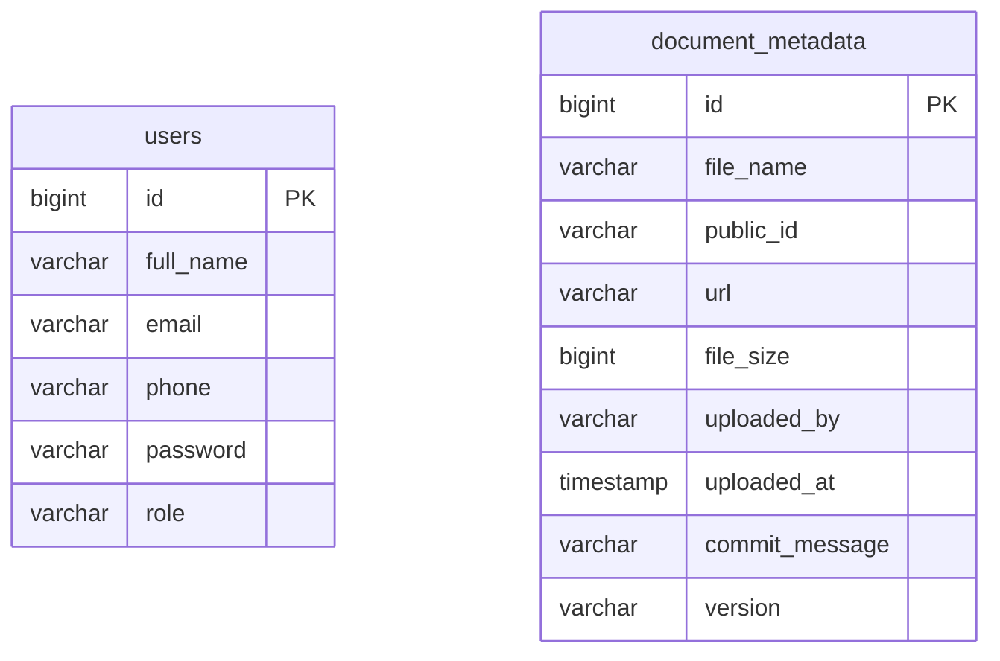

# Technical Report - Document Management System

**Dự án:** Document Management Backend + Frontend  
**Ngày tạo:** 06/04/2026  
**Người thực hiện:** Kiro AI (Senior Dev session)

---

## 2. Tóm tắt thay đổi (Summary)

- Cập nhật Cloudinary credentials thật vào `.env`
- Tạo entity `DocumentMetadata` để lưu metadata file vào PostgreSQL
- Tạo `DocumentMetadataRepository`
- Tạo DTO `FileUploadRequest` và cập nhật `FileUploadResponse`
- Rewrite `FileUploadService`: validate định dạng, versioning tự động (v1, v2...), lưu metadata
- Cập nhật `FileUploadController`: nhận `commitMessage`, lấy `uploadedBy` từ JWT
- Fix `UserSeeder`: tránh duplicate key khi restart
- Đổi `ddl-auto` từ `create-drop` → `update`
- Cập nhật frontend gửi `commitMessage` khi upload
- Đổi route `/dashboard` → `/upload`
- Tạo GitHub Actions CI/CD workflow deploy lên EC2

---

## 3. Chi tiết từng thay đổi

### 3.1 Cập nhật `.env`

**Vấn đề:** File `.env` có giá trị `placeholder` cho Cloudinary → upload luôn fail.

**File:** `BE/document-management-backend/.env`

```diff
- CLOUDINARY_CLOUD_NAME=placeholder
- CLOUDINARY_API_KEY=placeholder
- CLOUDINARY_API_SECRET=placeholder
+ CLOUDINARY_CLOUD_NAME=<your_cloud_name>
+ CLOUDINARY_API_KEY=<your_api_key>
+ CLOUDINARY_API_SECRET=<your_api_secret>
```

---

### 3.2 Tạo `DocumentMetadata` entity

**Vấn đề:** Không có bảng lưu metadata file (người upload, thời gian, version, commit message).

**File:** `BE/document-management-backend/src/main/java/com/example/documentmanagementbackend/model/DocumentMetadata.java`

```java
@Entity
@Table(name = "document_metadata")
@Getter @Setter @NoArgsConstructor @AllArgsConstructor @Builder
public class DocumentMetadata {
    @Id @GeneratedValue(strategy = GenerationType.IDENTITY)
    private Long id;

    @Column(name = "file_name", nullable = false)
    private String fileName;

    @Column(name = "public_id", nullable = false)
    private String publicId;

    @Column(name = "url", nullable = false, length = 1000)
    private String url;

    @Column(name = "file_size")
    private Long fileSize;

    @Column(name = "uploaded_by")
    private String uploadedBy;

    @Column(name = "uploaded_at", nullable = false)
    private LocalDateTime uploadedAt;

    @Column(name = "commit_message", nullable = false)
    private String commitMessage;

    @Column(name = "version", nullable = false)
    private String version;
}
```

**Giải thích:** Dùng `@Builder` để tiện tạo object trong service. `version` lưu dạng string `v1`, `v2`... để dễ đọc.

---

### 3.3 Tạo `DocumentMetadataRepository`

**File:** `BE/document-management-backend/src/main/java/com/example/documentmanagementbackend/repository/DocumentMetadataRepository.java`

```java
public interface DocumentMetadataRepository extends JpaRepository<DocumentMetadata, Long> {
    List<DocumentMetadata> findByFileNameOrderByUploadedAtDesc(String fileName);
}
```

**Giải thích:** Query theo `fileName` để đếm số version hiện có → tính version tiếp theo.

---

### 3.4 Tạo `FileUploadRequest` DTO

**File:** `BE/document-management-backend/src/main/java/com/example/documentmanagementbackend/dto/request/FileUploadRequest.java`

```java
@Getter @Setter
public class FileUploadRequest {
    private String commitMessage;
    private String uploadedBy;
}
```

---

### 3.5 Cập nhật `FileUploadResponse`

**Vấn đề:** Response cũ chỉ trả `url, publicId, fileName, size` — thiếu metadata.

**File:** `BE/document-management-backend/src/main/java/com/example/documentmanagementbackend/dto/response/FileUploadResponse.java`

```diff
- public FileUploadResponse(String url, String publicId, String fileName, long size)
+ public FileUploadResponse(String url, String publicId, String fileName, long size,
+     String version, String uploadedBy, LocalDateTime uploadedAt, String commitMessage)
```

---

### 3.6 Rewrite `FileUploadService`

**Vấn đề:** Service cũ không validate định dạng, không versioning, không lưu metadata.

**File:** `BE/document-management-backend/src/main/java/com/example/documentmanagementbackend/service/FileUploadService.java`

```java
// Trước: upload thẳng lên Cloudinary, không validate, không lưu DB
Map uploadResult = cloudinary.uploader().upload(file.getBytes(), ObjectUtils.asMap(...));
return new FileUploadResponse(url, publicId, filename, size);

// Sau: validate → tính version → upload → lưu metadata → trả response đầy đủ
private static final Set<String> ALLOWED_EXTENSIONS = Set.of("pdf", "doc", "docx", "xls", "xlsx");

public FileUploadResponse upload(MultipartFile file, String uploadedBy, String commitMessage) {
    // 1. Validate extension
    String ext = getExtension(originalFilename);
    if (!ALLOWED_EXTENSIONS.contains(ext)) throw new RuntimeException("Unsupported: " + ext);

    // 2. Tính version
    List<DocumentMetadata> existing = metadataRepository.findByFileNameOrderByUploadedAtDesc(originalFilename);
    String version = "v" + (existing.size() + 1);

    // 3. Upload Cloudinary với public_id = tên_file_version
    String publicId = "documents/" + stripExtension(originalFilename) + "_" + version;

    // 4. Lưu metadata vào DB
    metadataRepository.save(DocumentMetadata.builder()...build());

    // 5. Trả response đầy đủ
    return new FileUploadResponse(url, publicId, filename, size, version, uploader, now, commit);
}
```

**Giải thích kỹ thuật:**
- `public_id` trên Cloudinary gắn version để tránh ghi đè file cũ
- `commitMessage` mặc định là `"init file"` nếu không truyền
- `uploadedBy` lấy từ JWT token, fallback `"anonymous"`

---

### 3.7 Cập nhật `FileUploadController`

**Vấn đề:** Controller cũ không nhận `commitMessage`, không lấy user từ JWT.

**File:** `BE/document-management-backend/src/main/java/com/example/documentmanagementbackend/controller/FileUploadController.java`

```diff
- public ResponseEntity<FileUploadResponse> uploadFile(@RequestParam("file") MultipartFile file) {
-     FileUploadResponse response = fileUploadService.upload(file);

+ public ResponseEntity<FileUploadResponse> uploadFile(
+         @RequestParam("file") MultipartFile file,
+         @RequestParam(value = "commitMessage", required = false) String commitMessage,
+         @AuthenticationPrincipal UserDetails userDetails) {
+     String uploadedBy = (userDetails != null) ? userDetails.getUsername() : "anonymous";
+     FileUploadResponse response = fileUploadService.upload(file, uploadedBy, commitMessage);
```

---

### 3.8 Fix `UserSeeder`

**Vấn đề:** Seeder luôn chạy mỗi lần start → duplicate key exception khi DB đã có data.

**File:** `BE/document-management-backend/src/main/java/com/example/documentmanagementbackend/seeder/UserSeeder.java`

```diff
  public void run(String... args) {
+     if (userRepository.count() > 0) return; // Chỉ seed khi bảng trống
      List<User> seedUsers = List.of(...);
      userRepository.saveAll(seedUsers);
  }
```

---

### 3.9 Đổi `ddl-auto`

**Vấn đề:** `create-drop` xóa toàn bộ DB mỗi lần restart → mất data.

**File:** `BE/document-management-backend/src/main/resources/application.properties`

```diff
- spring.jpa.hibernate.ddl-auto=create-drop
+ spring.jpa.hibernate.ddl-auto=update
```

---

### 3.10 Cập nhật Frontend gửi `commitMessage`

**File:** `FE/my-react-app/src/page/UploadDashboard.jsx`

```diff
  const formData = new FormData();
  formData.append('file', item.file);
+ formData.append('commitMessage', 'init file');
```

---

### 3.11 Đổi route `/dashboard` → `/upload`

**File:** `FE/my-react-app/src/App.js`

```diff
- const DASHBOARD_ROUTE = '/dashboard';
+ const DASHBOARD_ROUTE = '/upload';
```

---

### 3.12 Tạo GitHub Actions CI/CD

**File:** `.github/workflows/deploy.yml`

Pipeline gồm 4 bước: checkout → build JAR → copy JAR lên EC2 qua SCP → SSH vào EC2 deploy.

---

## 4. Cấu hình & Biến môi trường

### `.env` (BE/document-management-backend/.env)

```env
CLOUDINARY_CLOUD_NAME=...        # Cloudinary cloud name
CLOUDINARY_API_KEY=...           # Cloudinary API Key
CLOUDINARY_API_SECRET=...        # Cloudinary API Secret
DB_URL=...                       # PostgreSQL connection string
DB_USER=...                      # DB username
DB_PASS=...                      # DB password
APPLICATION_SECRET_KEY=...       # JWT signing key (Base64)
APPLICATION_EXPIRATION=6000000   # JWT expiration (ms)
```

### GitHub Actions Secrets

```
EC2_HOST          # IP public của EC2
EC2_USERNAME      # ec2-user hoặc ubuntu
EC2_SSH_KEY       # Nội dung file .pem (private key)
ENV_FILE_CONTENT  # Toàn bộ nội dung file .env
```

### `application.properties` quan trọng

```properties
spring.jpa.hibernate.ddl-auto=update
spring.servlet.multipart.max-file-size=10MB
spring.servlet.multipart.max-request-size=20MB
application.service.impl.expiration=6000000
```

---

## 5. API Endpoints

| Method | Endpoint | Auth? | Request Body | Response | Mô tả |
|--------|----------|-------|--------------|----------|-------|
| POST | `/auth/login` | No | `{email, phoneNumber, password}` | JWT token (string) | Đăng nhập |
| POST | `/files/upload` | No (permitAll) | `multipart: file, commitMessage?` | `FileUploadResponse` | Upload file lên Cloudinary + lưu metadata |

### `FileUploadResponse` schema

```json
{
  "url": "https://res.cloudinary.com/...",
  "publicId": "documents/filename_v1",
  "fileName": "report.pdf",
  "size": 204800,
  "version": "v1",
  "uploadedBy": "user@example.com",
  "uploadedAt": "2026-04-06T13:02:36",
  "commitMessage": "init file"
}
```

---

## 6. Cấu trúc Database

### Bảng `users` (có sẵn)

| Column | Type | Constraint |
|--------|------|------------|
| id | BIGINT | PK, AUTO_INCREMENT |
| full_name | VARCHAR | NOT NULL |
| address | VARCHAR | |
| email | VARCHAR | UNIQUE, NOT NULL |
| phone | VARCHAR(15) | UNIQUE, NOT NULL |
| password | VARCHAR | NOT NULL (BCrypt) |
| role | VARCHAR | NOT NULL (USER/MANAGER/ADMIN) |

### Bảng `document_metadata` (mới tạo)

| Column | Type | Constraint |
|--------|------|------------|
| id | BIGINT | PK, AUTO_INCREMENT |
| file_name | VARCHAR | NOT NULL |
| public_id | VARCHAR | NOT NULL |
| url | VARCHAR(1000) | NOT NULL |
| file_size | BIGINT | |
| uploaded_by | VARCHAR | |
| uploaded_at | TIMESTAMP | NOT NULL |
| commit_message | VARCHAR | NOT NULL |
| version | VARCHAR | NOT NULL |



> Migration tự động qua `spring.jpa.hibernate.ddl-auto=update`

---

## 7. Data Flow

```
Upload Flow:
============

Browser (UploadDashboard.jsx)
  │
  │  POST /files/upload
  │  multipart: { file, commitMessage }
  ▼
FileUploadController
  │  @AuthenticationPrincipal → uploadedBy
  ▼
FileUploadService
  ├── validate extension (pdf/doc/docx/xls/xlsx)
  ├── query DocumentMetadataRepository → đếm version
  ├── upload to Cloudinary (resource_type=raw, public_id=name_vN)
  ├── save DocumentMetadata → PostgreSQL (Neon)
  └── return FileUploadResponse
  ▼
Browser
  └── update queue item: status=Done, progress=100%
```

---

## 8. Hướng dẫn cài đặt / Chạy lại

### Backend

```bash
# 1. Điền credentials vào .env
cd BE/document-management-backend
cp .env.example .env   # hoặc chỉnh trực tiếp .env

# 2. Build
./mvnw clean package -DskipTests

# 3. Chạy
./mvnw spring-boot:run
# hoặc
java -jar target/document-management-backend-*.jar
```

### Frontend

```bash
cd FE/my-react-app
npm install
npm start
# Truy cập: http://localhost:3000/upload
```

### EC2 (manual lần đầu)

```bash
# Cài Java 17
sudo yum install -y java-17-amazon-corretto

# Tạo thư mục app
mkdir -p /home/ec2-user/app

# Sau đó push lên main → GitHub Actions tự deploy
```

---

## 9. Các vấn đề đã gặp & cách khắc phục

| Vấn đề | Nguyên nhân | Cách khắc phục |
|--------|-------------|----------------|
| Upload fail 500 | Cloudinary credentials là `placeholder` | Cập nhật `.env` với credentials thật |
| Duplicate key khi restart | `UserSeeder` không check trước khi insert | Thêm `if (userRepository.count() > 0) return` |
| DB bị xóa mỗi lần restart | `ddl-auto=create-drop` | Đổi thành `update` |
| `DocumentMetadata` không tồn tại | File chưa được tạo | Tạo entity + repository mới |
| PowerShell block `npm start` | Execution policy | Dùng `cmd /c "npm start"` thay thế |
| `tail` không chạy trên Windows | Không có Unix tools | Dùng `Select-Object -Last N` |

---

## 10. Các bước tiếp theo (Next Steps)

- [ ] Kết nối Login form với API `/auth/login` (hiện tại nút Sign In chỉ navigate, không gọi API)
- [ ] Lưu JWT token vào `localStorage` sau khi login, gửi kèm `Authorization: Bearer <token>` khi upload
- [ ] Hiển thị danh sách file đã upload từ DB thay vì hardcode trong `VersionControl.jsx`
- [ ] Thêm endpoint `GET /files` để lấy danh sách metadata
- [ ] Thêm endpoint `GET /files/{fileName}/versions` để xem lịch sử version
- [ ] Validate file size trước khi upload ở frontend
- [ ] Thêm `commitMessage` input field trên UI thay vì hardcode `"init file"`
- [ ] Cấu hình HTTPS cho EC2 (nginx reverse proxy + SSL)
- [ ] Thêm health check endpoint `/actuator/health`
